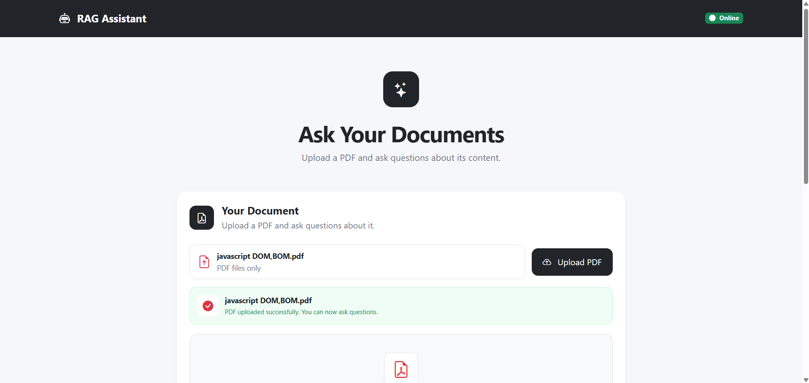
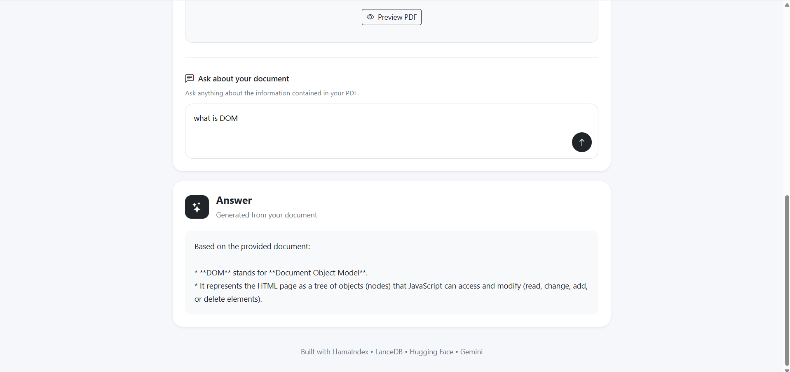

# RAG Document Assistant

A full-stack **Retrieval-Augmented Generation (RAG)** application that allows users to upload PDF documents and ask questions about their content.

The application extracts text from uploaded PDFs, splits the text into smaller chunks, converts those chunks into vector embeddings, stores them in LanceDB, retrieves the most relevant information for a user's question, and uses Google Gemini to generate an answer based only on the retrieved document context.

## 🚀 Features

* Upload PDF documents
* PDF file validation
* Upload progress indicator
* Upload success and failure status
* PDF preview in the browser
* Automatic text extraction from PDFs
* Text chunking for efficient retrieval
* Semantic vector embeddings
* Vector storage using LanceDB
* Similarity-based document retrieval
* Question answering using Google Gemini
* Answers generated from the uploaded document context
* Error handling for invalid uploads and failed requests
* Responsive frontend interface

## 🧠 How the RAG System Works

The application follows a Retrieval-Augmented Generation pipeline:

```text
                 PDF Upload
                     │
                     ▼
              PDF Text Extraction
                     │
                     ▼
                Text Chunking
                     │
                     ▼
             Generate Embeddings
                     │
                     ▼
                 LanceDB
              Vector Database
                     │
                     │
              User asks question
                     │
                     ▼
             Generate Query Vector
                     │
                     ▼
          Similarity Search in LanceDB
                     │
                     ▼
            Retrieve Relevant Chunks
                     │
                     ▼
              Document Context
                     │
                     ▼
               Google Gemini
                     │
                     ▼
                  Answer
```

### 1. Document Ingestion

When a PDF is uploaded, the backend receives the file using Multer.

The PDF is temporarily copied to a temporary directory and processed using LlamaIndex.

### 2. Text Extraction

Text is extracted from the uploaded PDF.

### 3. Text Chunking

The extracted text is divided into smaller chunks using LangChain's `RecursiveCharacterTextSplitter`.

The current configuration uses:

* Chunk size: `800`
* Chunk overlap: `100`

Chunking allows the application to retrieve smaller and more relevant sections of the document.

### 4. Embeddings

Each text chunk is converted into a vector embedding using:

```text
Xenova/all-MiniLM-L6-v2
```

The embedding model is executed locally using Hugging Face Transformers.

### 5. Vector Storage

The generated embeddings and their corresponding text are stored in:

```text
LanceDB
```

The vector database allows the application to perform similarity searches.

### 6. Question Retrieval

When the user asks a question:

1. The question is converted into an embedding.
2. LanceDB searches for the most similar document chunks.
3. The top relevant chunks are retrieved.
4. The retrieved chunks are combined into a context.

### 7. Answer Generation

The retrieved context is sent to Google Gemini.

The model is instructed to answer only using the supplied document context.

If the information is not available in the retrieved context, the application instructs the model to state that the information is not available in the document.

## 🛠️ Tech Stack

### Frontend

* HTML5
* CSS3
* JavaScript
* Bootstrap
* Bootstrap Icons

### Backend

* Node.js
* Express.js
* Multer
* CORS

### RAG / AI

* LlamaIndex
* LangChain Text Splitters
* Hugging Face Transformers
* `Xenova/all-MiniLM-L6-v2`
* Google Gemini

### Vector Database

* LanceDB

## 📁 Project Structure

```text
rag-document-assistant/
│
├── backend/
│   ├── server.js
│   └── ingest.js
│
├── frontend/
│   ├── index.html
│   ├── script.js
│   └── style.css
│
├── images/
│   ├── upload-success.png
│   └── rag-answer.png
│
├── .env.example
├── .gitignore
├── package.json
├── package-lock.json
└── README.md
```

## ⚙️ Installation

### 1. Clone the repository

```bash
git clone https://github.com/punniashaji/Rag-document-assistant.git
```

### 2. Navigate into the project

```bash
cd Rag-document-assistant
```

### 3. Install dependencies

```bash
npm install
```

### 4. Create the environment file

Create a file named:

```text
.env
```

Add:

```env
GEMINI_API_KEY=your_gemini_api_key_here
PORT=3000
```

Replace the placeholder with your own Google Gemini API key.

**Never commit your `.env` file to GitHub.**

### 5. Start the server

```bash
node backend/server.js
```

The application will run at:

```text
http://localhost:3000
```

Open that address in your browser.

## 🔑 Environment Variables

| Variable         | Description                          |
| ---------------- | ------------------------------------ |
| `GEMINI_API_KEY` | API key used to access Google Gemini |
| `PORT`           | Port used by the Express server      |

## 🔌 API Endpoints

### Upload PDF

```http
POST /api/upload
```

Accepts a PDF file using the multipart form field:

```text
pdf
```

Example successful response:

```json
{
  "message": "PDF uploaded and processed successfully.",
  "documents": 1,
  "chunks": 28
}
```

### Ask Question

```http
POST /api/ask
```

Request:

```json
{
  "question": "What is this document about?"
}
```

Response:

```json
{
  "answer": "..."
}
```

## 🔒 Security

Sensitive files and local application data are excluded from Git using `.gitignore`.

The following are intentionally not committed:

```text
.env
node_modules/
embeddings/
uploads/
```

The `.env.example` file is included so that other developers know which environment variables are required.

## 📌 Current Limitations

* The application currently focuses on PDF documents.
* The vector database is stored locally.
* Only the most relevant retrieved chunks are provided to the generation model.
* Authentication and user-specific document collections are not currently implemented.
* Large document collections may require additional optimization.

## 🔮 Future Improvements

Possible improvements include:

* Multiple document support
* Document management and deletion
* User authentication
* User-specific vector collections
* Chat history
* Streaming AI responses
* Improved citation and source references
* Better document metadata
* Cloud-based vector database
* Cloud deployment
* Docker support
* Production logging and monitoring

## 🎯 Project Goal

The goal of this project is to demonstrate a practical implementation of a **Retrieval-Augmented Generation system** using a full-stack JavaScript architecture.

It combines document processing, vector embeddings, semantic search, and generative AI into a single web application.


## 👨‍💻 Author

**Punnia Shaji**

Full-Stack Developer | JavaScript | Node.js | REST APIs | AI/RAG


---

## Screenshots

### PDF Upload



### RAG Question Answering

